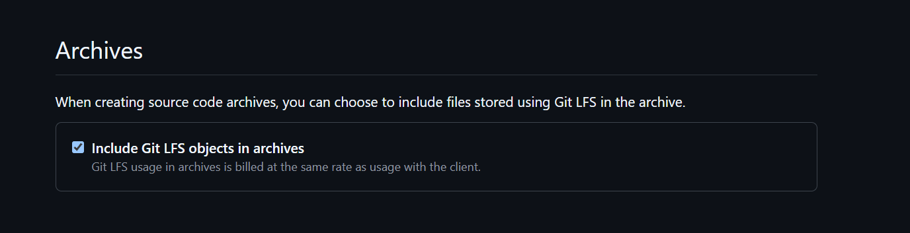
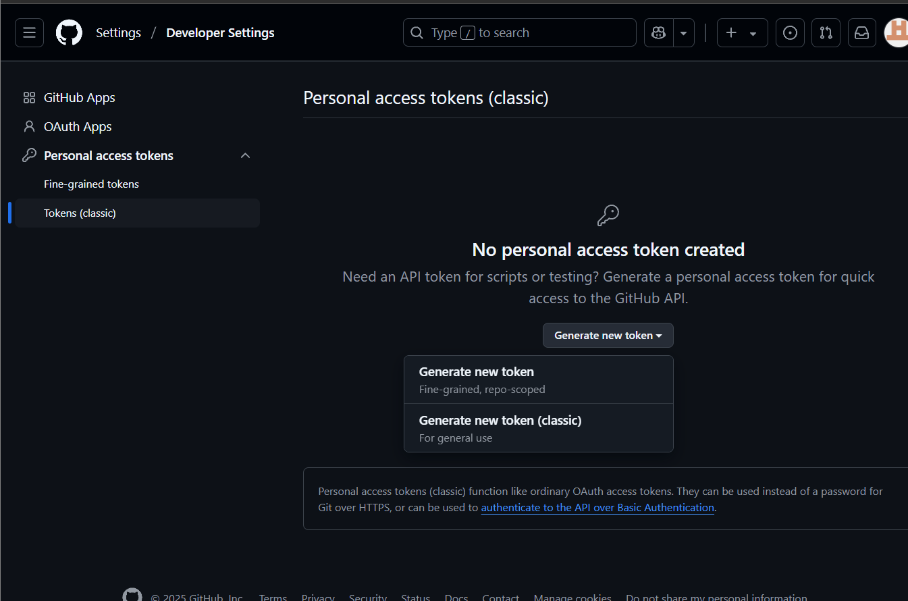
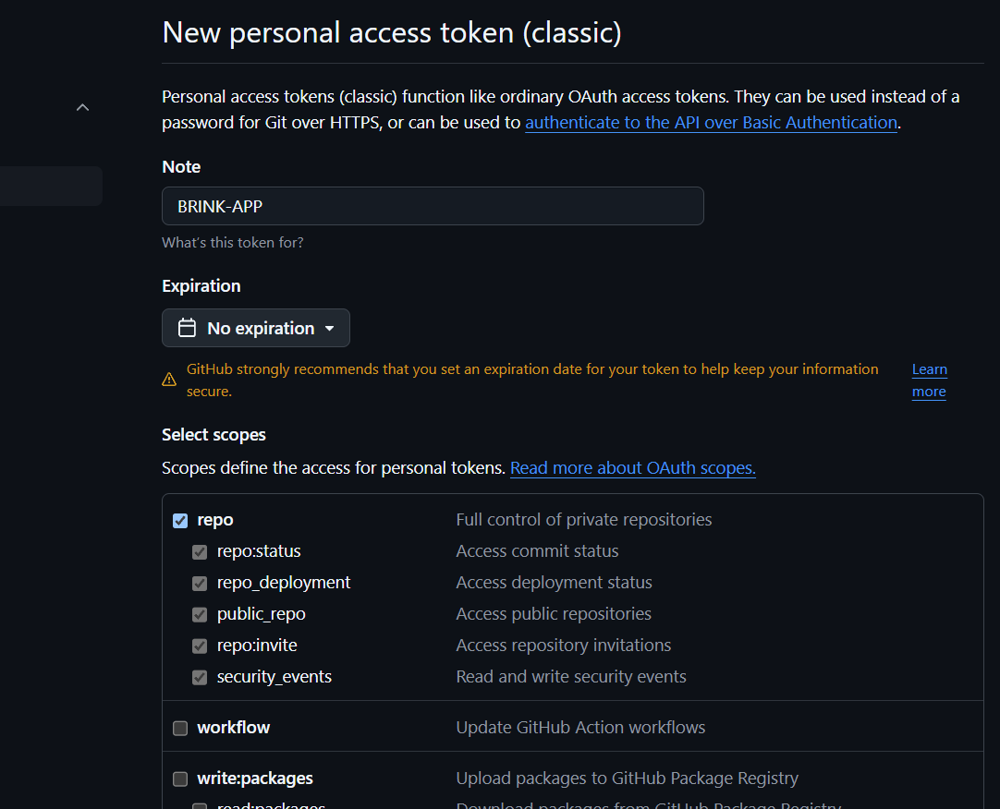

# brink-app

`1. git lfs install
2. git lfs track "*.als" "*.mp3" "*.wav" "*.flac" "*.aac" "*.ogg" "*.m4a" "*.alac" "*.aiff"
3. git add file.psd
   git commit -m "Add large file"
   git push origin master
   `

GitHub’s free LFS limit is 1 GB storage / 1 GB bandwidth per month

You can buy more LFS storage/bandwidth if needed

You can’t use GitHub Actions to push LFS-tracked files from inside the workflow unless you authenticate and configure LFS correctly

`git --version`

`mkdir my-project`

`cd my-project`

`git init`

`git config --global user.name "Your Name"`
`git config --global user.email "youremail@example.com"`

`echo # My Project > README.md`

`git lfs install`

`git lfs track "*.als" "*.mp3" "*.wav" "*.flac" "*.aac" "*.ogg" "*.m4a" "*.alac" "*.aiff"`

`git add .`

`git commit --author="Your Name <youremail@example.com>" -m "Brink project init"`

`git remote add origin https://github.com/SwiftFaze/brink-init-test.git`

`git push -u origin main`

